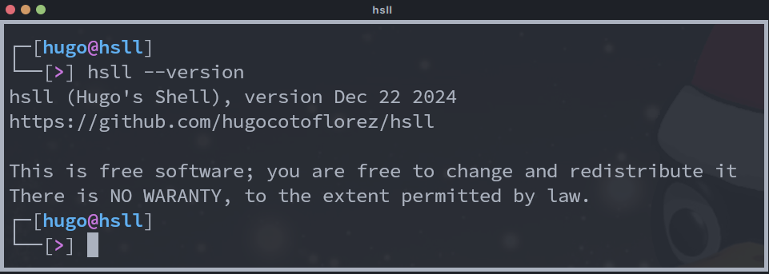

# Hugo's Shell

## Beta version

As I am developing this to have fun and I never aim to make an
useful shell, I dont recommend anyone to use hsll. It is interesting to
show how with a little C code you can build usefull apps and how easy is
to build extendible and expansible apps if you split code in functions and
files. Althought, it is an pseudo-posix shell, some stuff is not supported
directly, and those things that are supported may faild sometimes.
If you have to do non-compatible stuff from hsll I recommend to call
bash using `bash -c "some command"` and this shuld work fine.

## Things that (may) work

- Config file: ~/.hsllrc
- Path variables expansion
- Prompt (with colors and path variables)
- Cd ('-' and strange stuff is not implemented)
- Aliases
- History nav! with up and down arrows
- History: ~/.hsll-hist to perserve hist between sessions
- History: reset (clear) input box on min offset
- Completion: file, dir+file, command, command options
- Completion: autocomplete on unique command and same prefix
- Background commands using `&`
- Command concatenation: `&&`, `;`
- Interactive apps from terminal (vi, less, ...)
- Threat "some args with spaces" as a single arg (only doble quotes)
- $(command) expansion
- POSIX file regex expansion (*.c and this stuff)

## Compiling and installing

### Using frog

- Requisites: [frog](https://github.com/hugocotoflorez/frog)

- Compile frog.c: `gcc frog.c -o frog`
- For compile locally: `./frog`
- For install globally: `./frog && cp hsll ~/.local/bin`

### Using make

- For installing globaly: `make install`.
- For compile locally: `make`

> [!NOTE]
> `~/.local/bin/` have to be on PATH

## How to access shell variables

At least in my machine env variables such as HOST
are not accessible from hsll. I can fix it by
placing `export HOST` in the parent shell config.

## TODO

- redireccionamiento >, >>, <
- completion for alias
- which (dont expand alias)
- left and right arrows
- close temp file correcly

